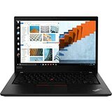

<!DOCTYPE html>
<html lang="en">

<head>
  <meta charset="UTF-8" />
  <meta http-equiv="X-UA-Compatible" content="IE=edge" />
  <meta name="viewport" content="width=device-width, initial-scale=1.0" />
  <link href="//db.onlinewebfonts.com/c/157c6cc36dd65b1b2adc9e7f3329c761?family=Amazon+Ember" rel="stylesheet" type="text/css"/>
  <link rel="stylesheet" href="style.css" />
  <link rel="stylesheet" media="screen and (max-width: 768px)"" href="mobile.css">
  <title>Document</title>
</head>

<body>
  <header>
    

      

        
      

      

        
      

      

        <input type="image" id="search-drop-down" src="images/search-bar-left.png" />
        <input type="search" name="searchbar" id="searchbar" />
        <input type="image" id="search-icon" src="images/search-Icon.png" />
      

      

        
      

      

        
      

      

        
      

      

        
      

    

    

      

        

          
        

        

          <a href="#">Local Delivery in Israel</a>
        

        

          <a href="#">today's deals</a>
        

        

          <a href="#">Customer Service</a>
        

        

          
        

        

          <a href="#">Benaya's Amazon.com</a>
        

        

          <a href="#">Buy Again</a>
        

        

          <a href="#">Gift Cards</a>
        

        

          <a href="#">Sell</a>
        

      

      

        <a href="#">Amazon's response to covid-19</a>
      

    

    

      <a href="#">Electronics > </a>
      <a href="#">Computers & Accesories > </a>
      <a href="#">Computers & Tablets > </a>
      <a href="#">Laptops > </a>
      <a href="#">2 in 1 Laptops</a>
    

  </header>
  

    <section class="left_side_pictures">
      

        <ul>
          <li>
            
          </li>
          <li>
            
          </li>
          <li>
            
          </li>
          <li>
            
          </li>
          <li>
            
          </li>
          <li>
            
          </li>
        </ul>
      

      

        
      

    </section>
    <main class="item_description">
      

        <h1>Lenovo Flex 5 14" 2-in-1 Laptop, 14.0" FHD (1920 x 1080) Touch Display, AMD Ryzen 5 4500U Processor, 16GB DDR4, 256GB SSD, AMD Radeon Graphics, Digital Pen Included, Win 10, 81X20005US, Graphite Grey</h1>
      
        
      
<a href="#" id="rating_store">Visit the Lenovo Store</a>

      

        
        <a href="#">3,426 ratings</a>
        |
        <a href="#">366 answered questions</a>
      

      

        

          Price 
          $709.00
           + $186.34 Shipping & Import Fees Deposit to Israel <a href="#">Details</a>         
        

        

          
Available at a lower price from <a href="#"">other sellers</a> that may not offer free Prime shipping.

        

        

          Style:
          Notebook only
          

            <button class="left-button">
Device + Mouse
--</button>
            <button class="right-button">
Notebook only
$709.00</button>
          

          

            
Brand

            
Lenovo

            
Operating System	

            
Windows 10
           
            
CPU Manufacturer	

            
AMD

            
Screen Size	

            
14 Inches

            
Computer Memory Size	

            
16 GB

          

          

            <h2>About this item</h2>
            <ul class="description-list">
              <li>Thin, light, and stylish – This 2-in-1 laptop weighs just 3.64 pounds and is only 0.82" thick. It's soft and comfortable to the touch, with a durable paint that creates a better user experience. Digital pen included</li>
              <li>The 10-point, 14-inch FHD (1920 x 1080) IPS touchscreen allows the Lenovo Flex 5 14" 2-in-1 laptop to be comfortable, fun, and easy to use. It's also great to look at, with 4-side narrow bezels</li>
              <li>The 360⁰ hinge lets you use your 2-in-1 touchscreen laptop in whatever mode works best for you; Use it in 'Laptop' mode for everyday computing, 'Tent' mode for sharing things, 'Stand' mode for binge-watching, or 'Tablet' mode for more intuitive interaction</li>
              <li>Enjoy up to 10 hours of battery life, plus quick charge to 80% in just 1 hour
              </li>
              <li>Powered by the AMD Ryzen 5 4500U mobile processor with Radeon graphics, you have the performance to do more, from anywhere. With more cores, you'll experience responsiveness that leaps into action for productivity, gaming, and content creation</li>
            </ul>
            

              <a href="#">›See more product details</a>
            

            

              <a href="#">Compare with similar items</a>
            

            

              <a href="#">New (13) from $697.99</a>
            

            

              <a href="#"> Report incorrect product information.</a>
            
           
          

        

      

    </main>
    <aside>
      

        

          
$716.00

          

            $187.87 Shipping & Import Fees Deposit to Israel

          
Arrives: <strong>Feb 26 - March 15</strong>

          

            In Stock
          

          <select name="quantity" id="qty" disabled="disabled"><option value="">Qty: 1</option></select>
          

            

              <button class="cart_button button">
Add to Cart
</button>
            

            

              <button class="buy_button button">
Buy Now
</button>
            

          

          

            <a href="#" class="secure">secure transaction</a>
            
ships from

            
Amazon

            
sold by

            
Emily's store

          

          

            
<strong>Add an Accessory</strong>

            <ul class="accessory_list_ul">
              <li>
                <input type="checkbox" name="" id="" /><a href="#">Microsoft 364 Microsoft 365 Family | 3 Months Free,
                Plus
                12-Mont...</a>
                
$89.99

              </li>
              <li>
                <input type="checkbox" name="" id="" /><a href="#">Adobe Acrobat Pro DC | PDF converter | 12-month
                  Su...</a>
                
$178.88

              </li>
              <li>
                <input type="checkbox" name="" id="" /><a href="#">McAfee Total Protection 2021,3 Device, Antivirus
                  I...</a>
                
$24.99

              </li>
              <li>
                <input type="checkbox" name="" id="" /><a href="#">TurboTax LIVE Deluxe, Tax Experts and CPAs on
                  Your...</a>
                
$119.99

              </li>
              <li>
                <input type="checkbox" name="" id="" />
                
Add a gift receipt for easy returns

              </li>

            </ul>
          
            
        

      

    </aside>
  

  

    

      <h2>Inspired by your recent shopping trends</h2>
    

    <button class="left-arrow carusel-button"><</button>
    <button class="right-arrow carusel-button">></button>
    

      

        
        

          <a href="#">Lenovo ThinkPad P53 Workstation Laptop (Intel i7-9750H 6-Core, 32GB RAM, 1TB SATA SSD, Quadro T1000, 15.6" Full HD…</a>
          
        

        
        

          <a href="#">Lenovo ThinkPad E15 15.6” Full HD IPS 1920 x 1080 Laptop, Core i5-10210U, 256 GB SSD, 8GB Ram, Win 10 Pro 64-bit</a>
            
        

        
        

          <a href="#">Lenovo ThinkPad X1 Yoga Gen 4 Laptop, 14.0" FHD IPS Touch 400 nits, i7-8665U, V-Pro, Webcam, Fingerprint Reader, USB-C,…</a>
          
        

        
        

          <a href="#">Lenovo ThinkPad X1 Yoga Gen 4 Laptop, 14.0" FHD IPS Touch 400 nits, i7-8665U, V-Pro, Webcam, Fingerprint Reader, USB-C,…</a>
          
        

        
        

          <a href="#">Lenovo ThinkPad X1 Yoga Gen 4 Laptop, 14.0" FHD IPS Touch 400 nits, i7-8665U, V-Pro, Webcam, Fingerprint Reader, USB-C,…</a>
          
        

        
        

          <a href="#">Lenovo ThinkPad X1 Yoga Gen 4 Laptop, 14.0" FHD IPS Touch 400 nits, i7-8665U, V-Pro, Webcam, Fingerprint Reader, USB-C,…</a>
          
        

      

      

        
        

          <a href="#">Lenovo ThinkPad X1 Yoga Gen 4 Laptop, 14.0" FHD IPS Touch 400 nits, i7-8665U, V-Pro, Webcam, Fingerprint Reader, USB-C,…</a>
          
        

        
        

          <a href="#">Lenovo ThinkPad X1 Yoga Gen 4 Laptop, 14.0" FHD IPS Touch 400 nits, i7-8665U, V-Pro, Webcam, Fingerprint Reader, USB-C,…</a>
          
        

        
        

          <a href="#">Lenovo ThinkPad X1 Yoga Gen 4 Laptop, 14.0" FHD IPS Touch 400 nits, i7-8665U, V-Pro, Webcam, Fingerprint Reader, USB-C,…</a>
          
        

        
        

          <a href="#">Lenovo ThinkPad X1 Yoga Gen 4 Laptop, 14.0" FHD IPS Touch 400 nits, i7-8665U, V-Pro, Webcam, Fingerprint Reader, USB-C,…</a>
          
        

        
        

          <a href="#">Lenovo ThinkPad X1 Yoga Gen 4 Laptop, 14.0" FHD IPS Touch 400 nits, i7-8665U, V-Pro, Webcam, Fingerprint Reader, USB-C,…</a>
          
        

        
        

          <a href="#">Lenovo ThinkPad X1 Yoga Gen 4 Laptop, 14.0" FHD IPS Touch 400 nits, i7-8665U, V-Pro, Webcam, Fingerprint Reader, USB-C,…</a>
          
        

      

    

  

</body>

</html>
